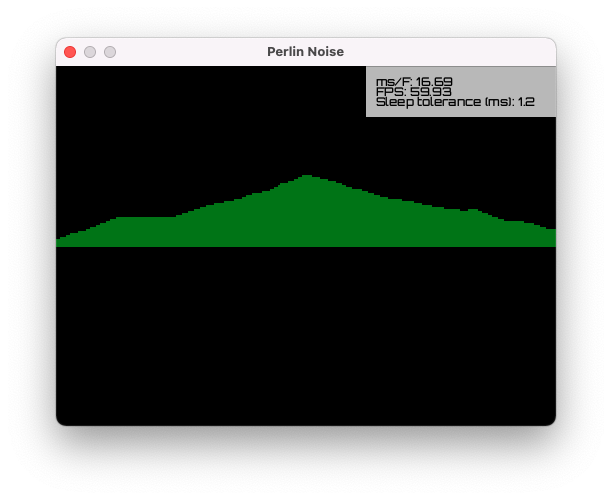

# Perlin Noise

Perlin Noise is a derivative of the following video by javidx9:

- [Programming Perlin-like Noise (C++)](https://youtu.be/6-0UaeJBumA)

It's been used to help me develop an understanding of:

- Perlin noise / random scenery generation.



To run:

```commandline
cargo run --example perlin-noise
```

## Notes

More information about [Perlin Noise](https://gpfault.net/posts/perlin-noise.txt.html).

## License

The source code for this example is subject to the [OLC-3 License](https://github.com/OneLoneCoder/olcPixelGameEngine/blob/master/LICENCE.md).
