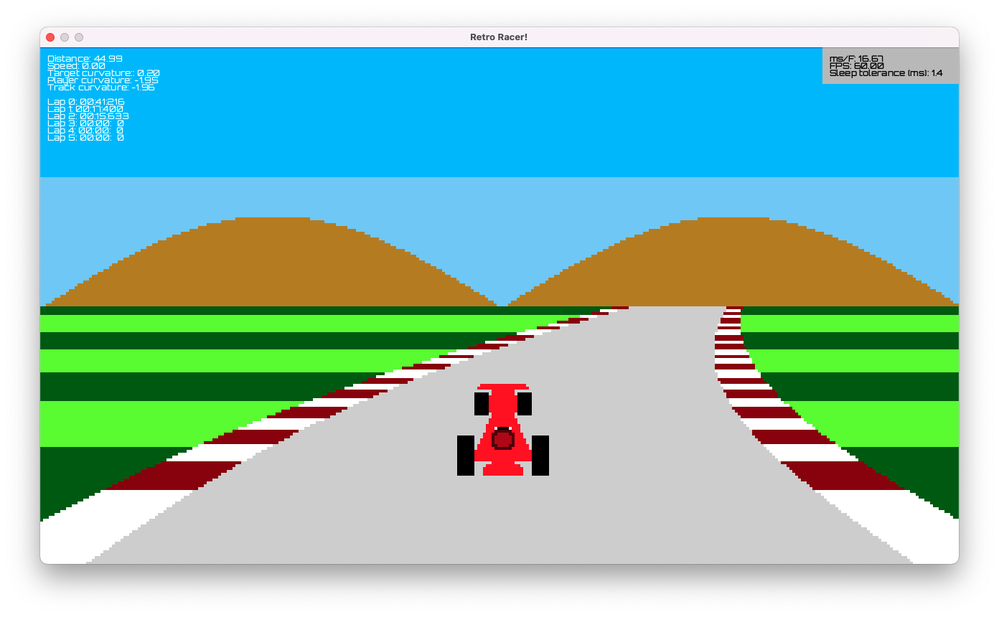

# Retro Racer

Retro Racer is a derivative of [Code-It-Yourself! Retro Arcade Racing Game - Programming from Scratch (Quick and Simple
C++)](https://youtu.be/KkMZI5Jbf18) by javidx9.



To run:

```commandline
cargo run --example retro-racer
```

## License

The source code for this example is subject to the [OLC-3 License](https://github.com/OneLoneCoder/olcPixelGameEngine/blob/master/LICENCE.md).
